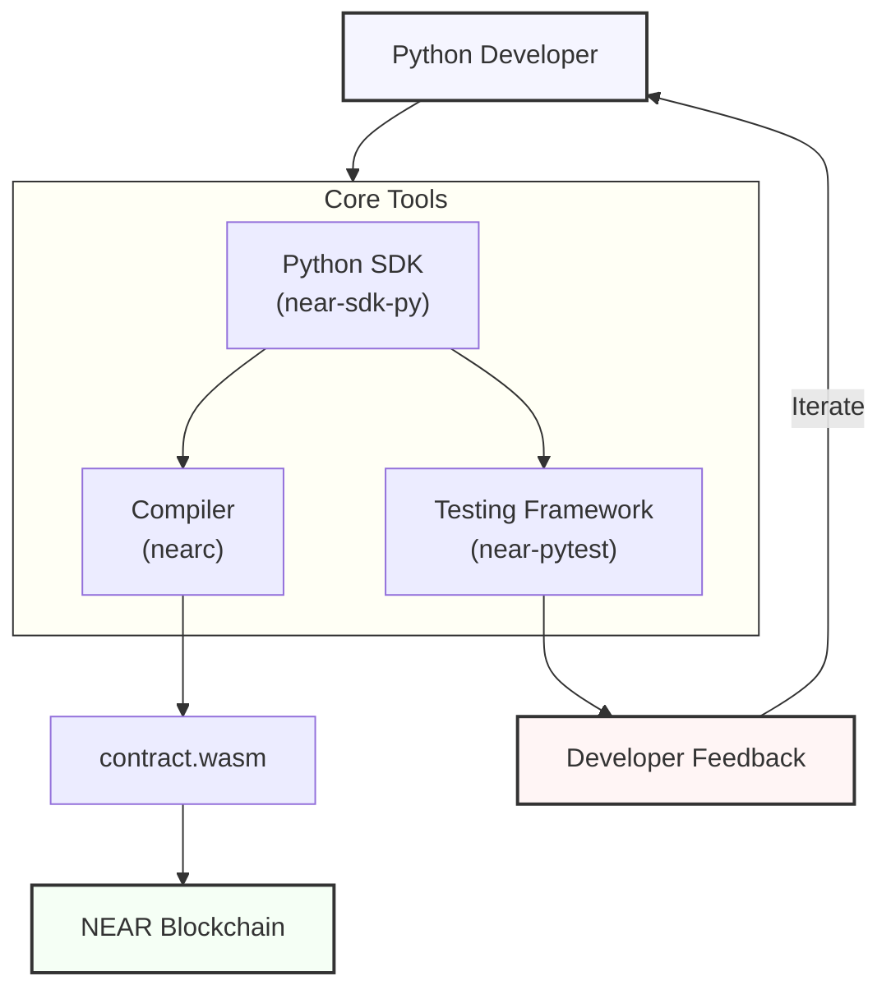

# NEAR Python Tooling Specification

This repository contains the specification for Python tooling in the NEAR ecosystem. The goal is to create a comprehensive, Pythonic development experience for NEAR smart contracts.

## Overview

The NEAR Python Tooling initiative aims to make it as easy as possible for Python developers to build, test, and deploy smart contracts on NEAR Protocol.

This specification outlines:

- A compiler for Python → WASM conversion
- A comprehensive SDK for contract development
- Testing frameworks for both unit and integration tests
- Developer tools for improved workflow

## Documents

- [Architecture Overview](architecture-overview.md) - Visual explanation of how components fit together
- [Developer Specification](developer-spec.md) - Skimmable guide with practical examples
- [Detailed Specification](detailed-spec.md) - Comprehensive specification with implementation details

## Key Features

- **Python-first approach**: Leverage Python's simplicity and extensive ecosystem
- **Full development lifecycle**: Write, test, and deploy contracts in a seamless workflow
- **Testing frameworks**: Both unit testing and integration testing support
- **Developer ergonomics**: Familiar patterns and tools for Python developers
- **Interoperability**: Works with existing NEAR tools and standards

## Current Status

This is a draft specification intended to gather feedback from the community. No code has been implemented yet.

## Components Overview

| Component              | Purpose                        | Status  |
| ---------------------- | ------------------------------ | ------- |
| **nearc**              | Python to WASM compiler        | Planned |
| **near-sdk-py**        | Smart contract development SDK | Planned |
| **near-pytest**        | Unit testing framework         | Planned |
| **near-sandbox**       | Local NEAR node                | Planned |
| **near-workspaces-py** | Integration testing            | Planned |
| **near-py-vm**         | Fast simulation environment    | Future  |

## Feedback

Please open an issue in this repository with any feedback or suggestions.
