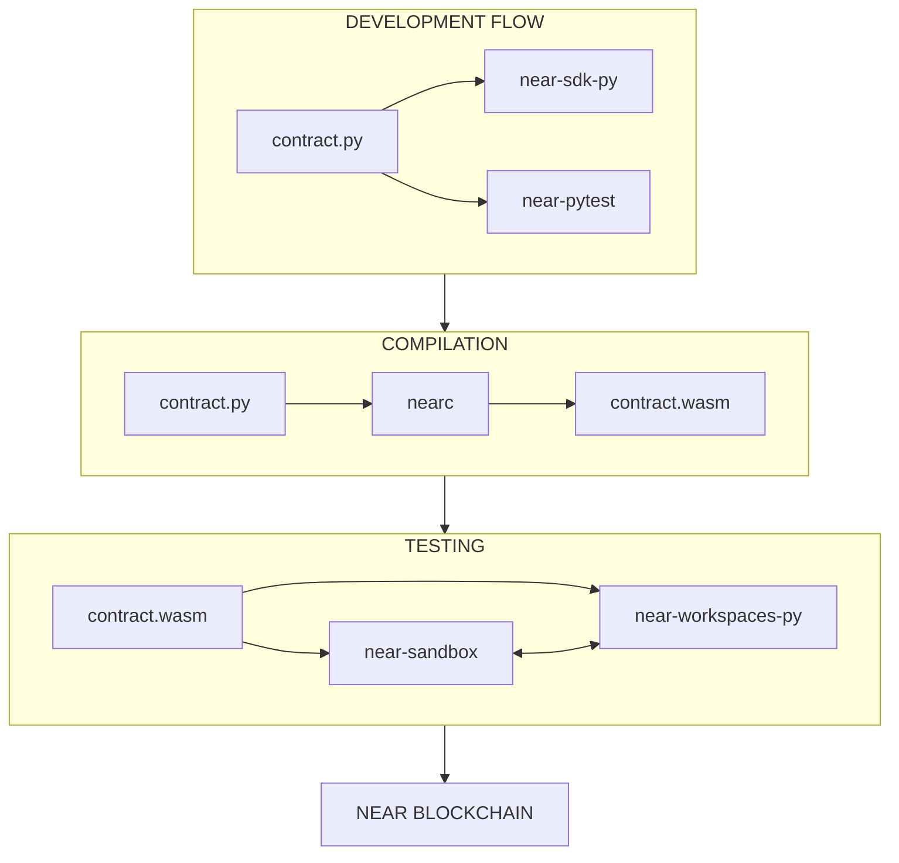
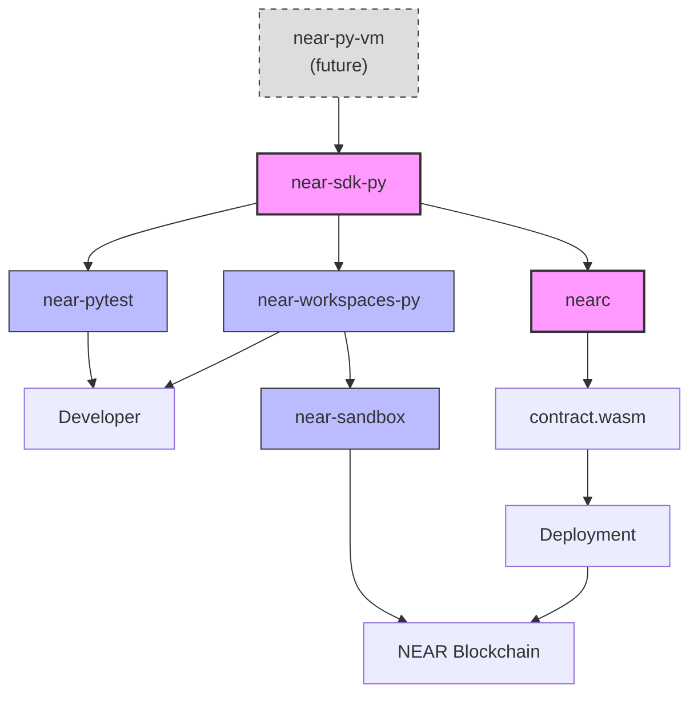
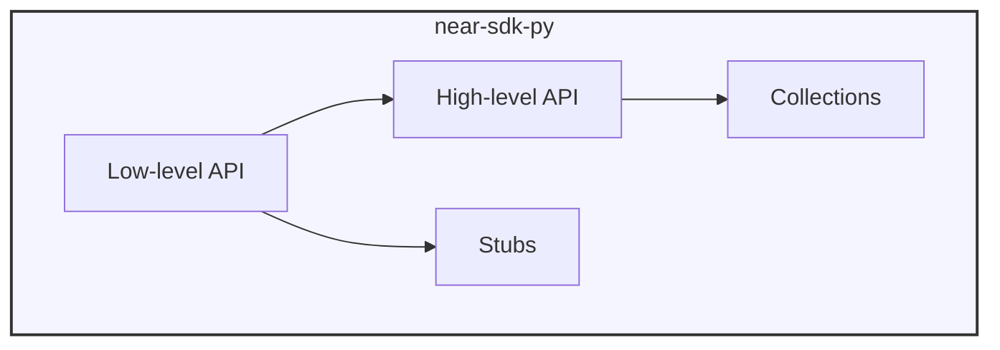
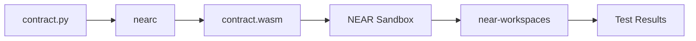
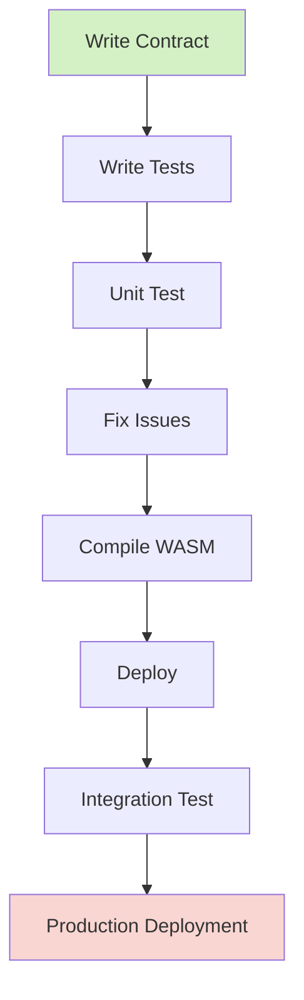
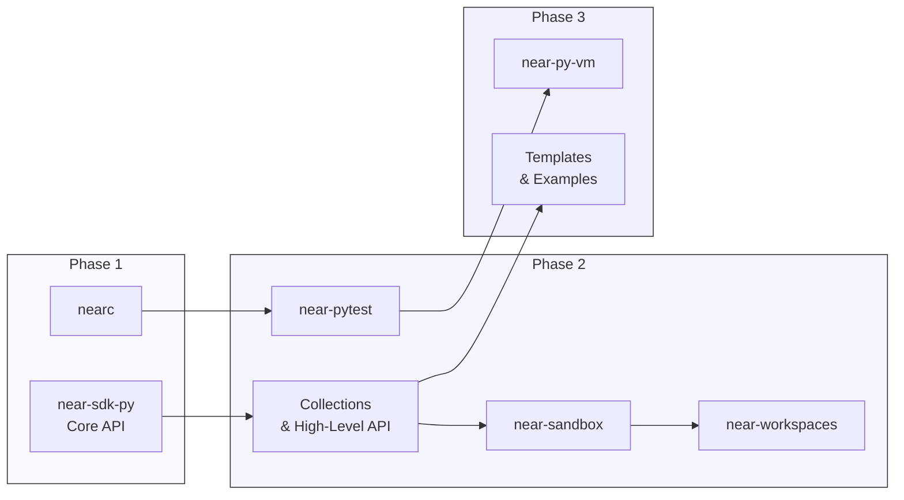

# NEAR Python Tooling: Architecture Overview

## System Architecture

This diagram shows the overall development flow from writing Python code to deployment on NEAR blockchain:

## Component Relationships

How the tools connect and interact with each other:

## Module Composition

How the near-sdk-py is structured internally:

## Data Flow

How data moves through the system:

## Development Workflow

The typical developer workflow:

## Component Breakdown

### Core Components

| Component            | Purpose                                 | Depends On              | Used By                        |
| -------------------- | --------------------------------------- | ----------------------- | ------------------------------ |
| `near-sdk-py`        | Python library for contract development | N/A                     | Developers, nearc              |
| `nearc`              | Compiler from Python to WASM            | MicroPython, Emscripten | CI/CD, Developers              |
| `near-pytest`        | Unit testing framework                  | near-sdk-py             | Developers, CI                 |
| `near-sandbox`       | Local NEAR node                         | near-cli-rs             | near-workspaces-py, Developers |
| `near-workspaces-py` | Integration testing                     | near-sandbox            | Developers, CI                 |

### Optional Components

| Component         | Purpose                      | Implementation Difficulty |
| ----------------- | ---------------------------- | ------------------------- |
| `near-py-vm`      | Fast iteration simulation    | High                      |
| Project Templates | Scaffolding for new projects | Low                       |
| CI/CD Templates   | Ready-to-use CI/CD configs   | Low                       |
| IDE Extensions    | Better tooling integration   | Medium                    |

## Implementation Priority

